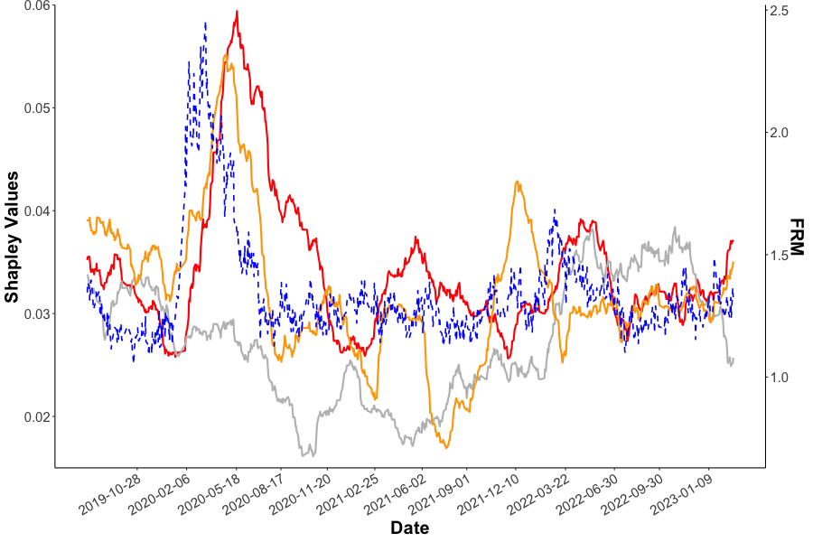

[](http://quantlet.de/)

## [](http://quantlet.de/) **FRM_Quantlet_China** [](http://quantlet.de/)

```yaml


Name of Quantlet: FRM_Quantlet_China
Published in: 'hu.berlin/FRM; firamis.de/frm'
Description: 'Use FRM in China and detect Shapley value of macro features'
Keywords: 'returns, linear, quantile, LASSO, L1-norm penalty, Shapley, Financial Risk Meter'
Author: 'Ruting Rainy WANG' 
Submitted:  '10.08.2021'
```


